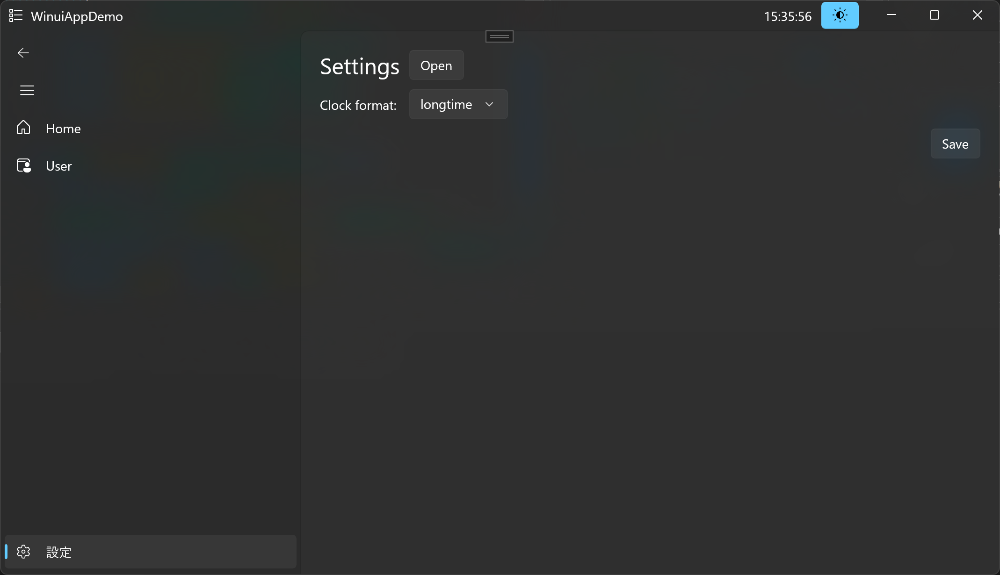

<!-- ============================================================
  Project Image
 ============================================================ -->
<div align=center>
  
</div>

<!-- ============================================================
  Overview
 ============================================================ -->
# :book:Overview

<!-- [](./README.md) -->
[](./README.md)
[](./LICENSE)

[](https://www.microsoft.com/ja-jp/windows?r=1)
[](https://learn.microsoft.com/ja-jp/cpp/?view=msvc-170)

Windows App SDK (WinUI3 / C++)を用いたGUIアプリです。

- MVVMパターン
- Dependency Injection

> [!note]
> Windows App SDK (WinUI3 / C#)は[こちら](https://github.com/r-dev95/WinuiAppDemo)。
>
> 物理ディレクトリやnamespaceを切る際、自動生成されるファイルに整合性が合わない問題があったので対処を[こちら](docs/memo.md)に示します。

<!-- ============================================================
  Features
 ============================================================ -->
## :desktop_computer:Features

<div align=center>
  
</div>

### Main window (Shell page)

- 時計表示機能
- テーマ切り替え機能 (ライト/ダーク)
- ナビゲーション機能

### Settings page

- エクスプローラ起動機能 (設定ファイルのディレクトリ)
- 時計表示フォーマット変更機能
- 設定保存機能

<!-- ============================================================
  Usage
 ============================================================ -->
## :keyboard:Usage

### Install

```bash
git clone https://github.com/r-dev95/CppWinuiAppDemo.git
```

<!-- ============================================================
  License
 ============================================================ -->
## :key:License

本リポジトリは、[MIT License](LICENSE)に基づいてライセンスされています。
